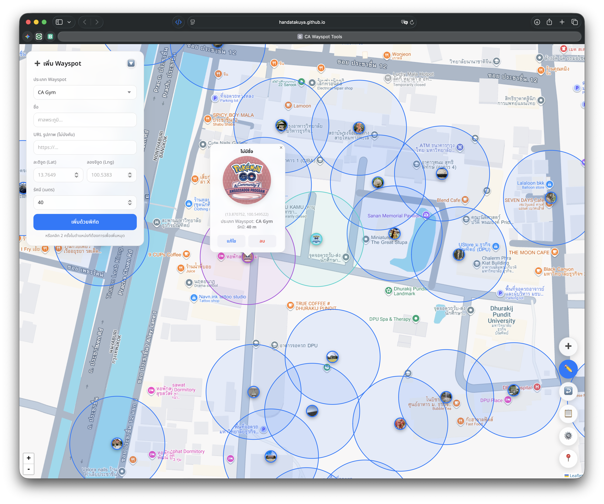

# 📍 CA Wayspot Tools (v2.7.4)

**เครื่องมือช่วยวางแผนและจำลองตำแหน่ง Wayspot สำหรับชุมชน Community Ambassador Thailand**

CA Wayspot Tools คือเว็บแอปพลิเคชัน (PWA) ที่ออกแบบมาเพื่อช่วย Community Ambassador สามารถวางแผนจุดตั้งเสา (Wayspot) สำหรับ Campsite ของตัวเองได้อย่างแม่นยำ คำนวณระยะห่าง และเช็คขอบเขต S2 Cells ได้ในที่เดียว

## ✨ คุณสมบัติใหม่และเด่น (Key Features)

- **🎨 Multi-Theme Support:** มีให้เลือกถึง 4 ธีม (Classic, Dark, Liquid Glass, และ Pokemon GO)
- **📁 Project Management:** ระบบจัดการโปรเจค แยกการทำงานเป็นโครงการต่าง ๆ ได้อย่างเป็นระเบียบ
- **🚫 Exclusion Zone (40m):** จำลองพื้นทีทับซ้อน 40 เมตร รอบทุก Wayspot เพื่อการวางแผนที่ถูกต้องตามกฎความหนาแน่น
- **☰ Speed Dial Menu:** หน้าจอ UI แบบใหม่ รวบรวมเครื่องมือให้เข้าถึงง่ายและสะอาดตา
- **📸 Map Capture:** บันทึกภาพแผนที่ (Screenshot) เพื่อนำไปใช้งานหรือแชร์ต่อได้ทันที
- **🔍 Wayspot Search:** เพิ่มช่องค้นหาในรายชื่อ Wayspot ทั้งหมด ช่วยให้ค้นหาจุดที่ต้องการได้รวดเร็ว
- **🗺️ Pokemon GO Map:** รองรับการแสดงผลแผนที่สไตล์ Pokemon GO (Mapbox)
- **Firebase Live Collaboration**: แชร์หน้าจอและทำงานร่วมกันบนแผนที่แบบ Real-time (แชร์รหัสห้องให้ทีมงาน ผู้ใช้ที่ไม่ได้เป็นโฮสต์สามารถดึงข้อมูล เพิ่ม เปลี่ยนประเภท และลบเสาได้อย่างอิสระ ผ่าน Firebase Backend)
- **JSON Import/Export**: รองรับการนำเข้าและส่งออกข้อมูลทั้งหมดเพื่อเก็บเป็นสำรอง
- **Local Map Interaction (Leaflet + Google Maps / Mapbox)**: ระบบแผนที่โต้ตอบได้
- **S2 Grid Overlay**: ฟังก์ชันแสดงตารางกริด S2 (Level 14 & 17) เพื่อวางแผนการเกิดยิมและจุดเสาอย่างแม่นยำ
- **☁️ Google Drive Sync:** สำรองข้อมูลและดึงข้อมูลกลับมาใช้งานผ่าน Google Drive ได้โดยตรง
- **📱 PWA Ready:** ติดตั้งลงบนมือถือได้เหมือนแอปทั่วไป ใช้งานสะดวกทุกที่

## 🚀 วิธีการใช้งานเบื้องต้น

1. **การเพิ่มจุด:** คลิก 2 ครั้งในตำแหน่งทีต้องการเพื่อเพิ่มหมุด หรือกรอกพิกัด Lat/Lng ในแถบเมนู
2. **การแก้ไข:** ใช้เครื่องมือ "แก้ไขตำแหน่ง" (ไอคอนดินสอ) เพื่อลากย้ายจุดหรือเปลี่ยนชื่อ
3. **การดูขอบเขต:** เปิดการตั้งค่า (ไอคอนเฟือง) เพื่อเปิด "แสดง S2 Cells"
4. **การบันทึก:** ข้อมูลจะถูกบันทึกใน Browser อัตโนมัติ หรือเลือกบันทึกขึ้น Cloud ผ่านเมนู Google Drive

## 🛠 เทคโนโลยีที่ใช้ (Tech Stack)

- **Frontend:** HTML5, CSS3, Vanilla JavaScript (Modern UI with Glassmorphism)
- **Map Engine:** [Leaflet.js](https://leafletjs.com/) & [Mapbox GL JS](https://www.mapbox.com/mapbox-gljs)
- **Utilities:** [html-to-image](https://github.com/tsayen/html-to-image) (สำหรับบันทึกภาพ)
- **Geometry:** [S2-Geometry](https://github.com/v88/s2-geometry-javascript)
- **Sync:** Google Drive API (GSI)
- **Design:** ระบบ i18n รองรับภาษาไทยและอังกฤษ พร้อมระบบธีมที่ปรับแต่งได้

## 👥 เครดิต (Credits)

จัดทำโดย **CA: Community Ambassador Thailand**
สร้างขึ้นเพื่อเป็นเครื่องมือกลางให้เพื่อนๆ ในชุมชนได้พัฒนาพื้นที่ของตัวเองได้ง่ายขึ้น
