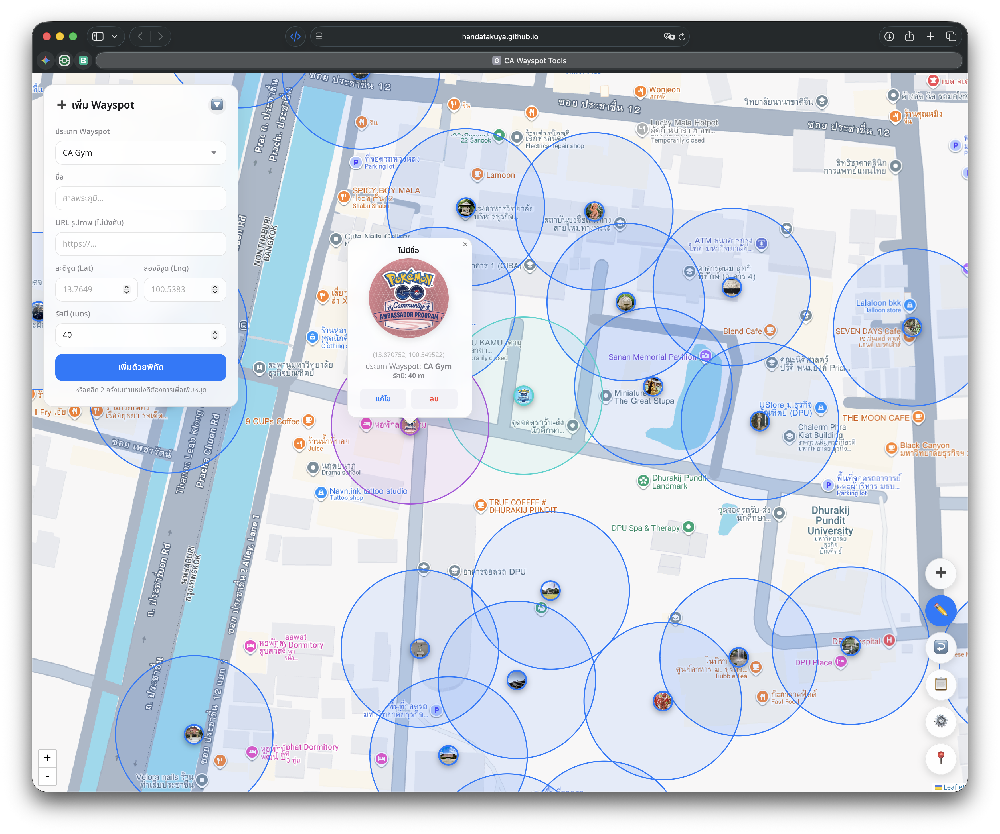

# 📍 CA Wayspot Tools (v4.0.1)

**เครื่องมือช่วยวางแผนและจำลองตำแหน่ง Wayspot สำหรับชุมชน Community Ambassador Thailand**

CA Wayspot Tools คือเว็บแอปพลิเคชัน (PWA) ที่ออกแบบมาเพื่อช่วย Community Ambassador สามารถวางแผนจุดตั้งเสา (Wayspot) สำหรับ Campsite ของตัวเองได้อย่างแม่นยำ คำนวณระยะห่าง เช็คขอบเขต S2 Cells และจำลองภาพ 3 มิติได้ในที่เดียว

---

## 🆕 สิ่งใหม่ใน v4.0.1

- **🗺️ POI จริงจาก Wayfarer (ใหม่ทั้งหมด):** ดึง PokéStop / Gym / Power Spot จริงจาก Niantic มาแสดงบนแผนที่ทันที พร้อมรูปภาพจริงและวงกลม Exclusion Zone 45m สีตามประเภท — ใช้เทียบวางแผนจุดใหม่กับของจริงในพื้นที่ได้เลย (ข้อมูลอ่านอย่างเดียว)
- **🔑 จัดการ Campfire API Token:** ตั้งค่า token ได้ง่ายทั้งบนคอมพิวเตอร์ (ลาก Bookmarklet) และมือถือ (iOS Shortcut + สแกน QR) ระบบตรวจสอบความถูกต้องกับ Campfire ให้อัตโนมัติ พร้อมแสดงชื่อบัญชีและวันที่อัปเดต — token เก็บอยู่ในเครื่องนี้เท่านั้น ไม่ถูกส่งออกไปที่ใด
- **👁️ ซ่อน/แสดง Wayspot:** ซ่อนได้ทั้งทีละจุด (ปุ่มตาบน popup หรือ checkbox ในรายการ) และซ่อนทั้งหมวดหมู่ในคลิกเดียว ใช้ได้ทั้ง Wayspot ที่สร้างเองและ POI จาก Wayfarer
- **🎯 โหมดวาดเขตเลือก (Draw Mode):** วาดพื้นที่อิสระบนแผนที่เพื่อเลือก Wayspot/POI ที่อยู่ในเขตทีเดียว แล้วลบหรือ Export เป็น JSON/KML ได้ทันที
- **⚡ ปรับปรุงประสิทธิภาพ:** การโหลด POI จาก Wayfarer หน่วงเวลาและมีเกณฑ์ระดับซูมขั้นต่ำ กันแอปค้างเวลาซูม/เลื่อนแผนที่เร็วๆ
- **📱 ปุ่มลอย (FAB) เล็กลง 40% บนมือถือ:** ลดพื้นที่บังแผนที่ ใช้งานสะดวกขึ้นบนหน้าจอเล็ก

---

## ✨ คุณสมบัติทั้งหมด (Key Features)

- **🗺️ POI จริงจาก Wayfarer:** แสดง PokéStop / Gym / Power Spot จริงจาก Niantic แบบ Live พร้อมรูปภาพและ Exclusion Zone 45m, ตั้งค่า Campfire Token เพื่อดู Power Spot, ซ่อน/แสดงและวาดเขตเลือกได้เหมือน Wayspot ปกติ
- **📥 CA Wayspot Exporter:** รองรับการดึงข้อมูล Wayspot และสถานที่จริงจากเว็บ Niantic Wayfarer โดยตรงผ่านสคริปต์เสริม เพื่อนำมาวางแผนต่อได้ทันที
- **🧲 Drag & Drop Import:** สามารถลากไฟล์ .json หรือ .kml มาวางบนหน้าจอแผนที่เพื่อนำเข้าข้อมูลได้อย่างรวดเร็ว
- **🎯 วาดเขตเลือก (Draw Mode):** วาด polygon อิสระเพื่อเลือก Wayspot/POI หลายจุดพร้อมกัน แล้วลบหรือ Export เป็น JSON/KML
- **👁️ ซ่อน/แสดง Wayspot:** ซ่อนทีละจุดหรือทั้งหมวดหมู่ได้ทั้ง Wayspot ของตัวเองและ POI จาก Wayfarer
- **🎨 Multi-Theme Support:** มีให้เลือกถึง 4 ธีม (Classic, Dark, Liquid Glass, และ Pokemon GO)
- **📁 Project Management:** ระบบจัดการโปรเจค แยกการทำงานเป็นโครงการต่าง ๆ ได้อย่างเป็นระเบียบ
- **🚫 Exclusion Zone (45m):** จำลองพื้นที่ทับซ้อน 45 เมตร รอบทุก Wayspot เพื่อการวางแผนที่ถูกต้องตามกฎความหนาแน่น
- **🌐 3D Simulation View:** จำลองพื้นที่แบบ 3 มิติบนแผนที่จริง พร้อมโมเดล PokeStop / Gym / Power Spot, Joystick, Double-click Teleport และรัศมีผู้เล่น 80m
- **☰ Speed Dial Menu:** หน้าจอ UI แบบใหม่ รวบรวมเครื่องมือให้เข้าถึงง่ายและสะอาดตา ปรับขนาดปุ่มลอยให้เหมาะกับมือถือ
- **📸 Map Capture:** บันทึกภาพแผนที่ (Screenshot) เพื่อนำไปใช้งานหรือแชร์ต่อได้ทันที
- **🔍 Wayspot Search:** เพิ่มช่องค้นหาในรายชื่อ Wayspot ทั้งหมด ช่วยให้ค้นหาจุดที่ต้องการได้รวดเร็ว
- **🗺️ Pokemon GO Map:** รองรับการแสดงผลแผนที่สไตล์ Pokemon GO (Mapbox)
- **Firebase Live Collaboration:** แชร์หน้าจอและทำงานร่วมกันบนแผนที่แบบ Real-time
- **JSON & KML Import/Export:** รองรับการนำเข้าและส่งออกข้อมูลเพื่อเก็บเป็นสำรองหรือนำไปใช้ใน Google My Maps (รวมถึง Export เฉพาะส่วนที่เลือกจาก Draw Mode)
- **S2 Grid Overlay:** ฟังก์ชันแสดงตารางกริด S2 (Level 14 & 17) เพื่อวางแผนการเกิดยิมและจุดเสาอย่างแม่นยำ
- **☁️ Google Drive Sync:** สำรองข้อมูลและดึงข้อมูลกลับมาใช้งานผ่าน Google Drive ได้โดยตรง
- **📱 PWA Ready:** ติดตั้งลงบนมือถือได้เหมือนแอปทั่วไป ใช้งานสะดวกทุกที่

---

## 🚀 วิธีการใช้งานเบื้องต้น

1. **การเพิ่มจุด:** คลิก 2 ครั้งในตำแหน่งที่ต้องการเพื่อเพิ่มหมุด หรือกรอกพิกัด Lat/Lng ในแถบเมนู
2. **การแก้ไข:** ใช้เครื่องมือ "แก้ไขตำแหน่ง" (ไอคอนดินสอ) เพื่อลากย้ายจุดหรือเปลี่ยนชื่อ
3. **การดูขอบเขต:** เปิดการตั้งค่า (ไอคอนเฟือง) เพื่อเปิด "แสดง S2 Cells"
4. **การบันทึก:** ข้อมูลจะถูกบันทึกใน Browser อัตโนมัติ หรือเลือกบันทึกขึ้น Cloud ผ่านเมนู Google Drive
5. **3D View:** กดปุ่ม 3D Simulation เพื่อเข้าสู่มุมมอง 3 มิติ — ใช้ Joystick เพื่อเดิน หรือดับเบิ้ลคลิกบนแผนที่เพื่อ Teleport
6. **ดู POI จาก Wayfarer:** เปิดเมนู "การตั้งค่า" → "POI จาก Wayfarer" เพื่อดู PokéStop/Gym จริงในพื้นที่ (Power Spot ต้องตั้งค่า Campfire Token ก่อน — มีวิธีในหน้าเดียวกัน)
7. **วาดเขตเลือก:** กดปุ่ม 🎯 ในเมนูลอย คลิกบนแผนที่วาดเขต ดับเบิ้ลคลิกเพื่อจบ แล้วเลือกลบหรือ Export เฉพาะจุดในเขตนั้นได้ทันที

---

## 🛠 เทคโนโลยีที่ใช้ (Tech Stack)

- **Frontend:** HTML5, CSS3, Vanilla JavaScript (Modern UI with Glassmorphism)
- **Map Engine:** [Leaflet.js](https://leafletjs.com/) & [Mapbox GL JS](https://www.mapbox.com/mapbox-gljs)
- **3D Engine:** [Three.js r128](https://threejs.org/) (Procedural models, OrbitControls, WebGL renderer)
- **Utilities:** [html-to-image](https://github.com/tsayen/html-to-image) (สำหรับบันทึกภาพ)
- **Geometry:** [S2-Geometry](https://github.com/v88/s2-geometry-javascript)
- **QR Code:** [qrcode](https://github.com/soldair/node-qrcode) (สำหรับ QR ติดตั้ง Campfire Token Shortcut)
- **Sync:** Google Drive API (GSI)
- **Design:** ระบบ i18n รองรับภาษาไทยและอังกฤษ พร้อมระบบธีมที่ปรับแต่งได้

---

## 👥 เครดิต (Credits)

จัดทำโดย **CA: Community Ambassador Thailand**
สร้างขึ้นเพื่อเป็นเครื่องมือกลางให้เพื่อนๆ ในชุมชนได้พัฒนาพื้นที่ของตัวเองได้ง่ายขึ้น
